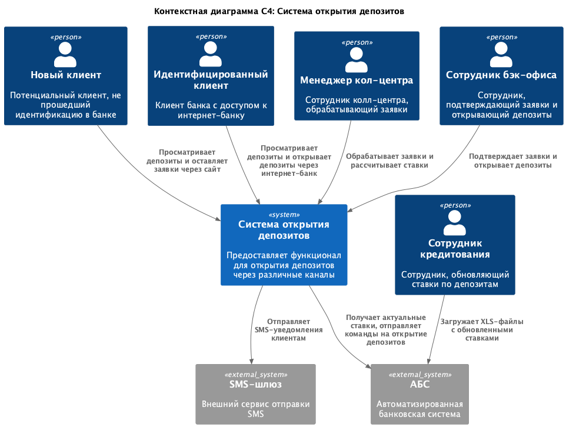
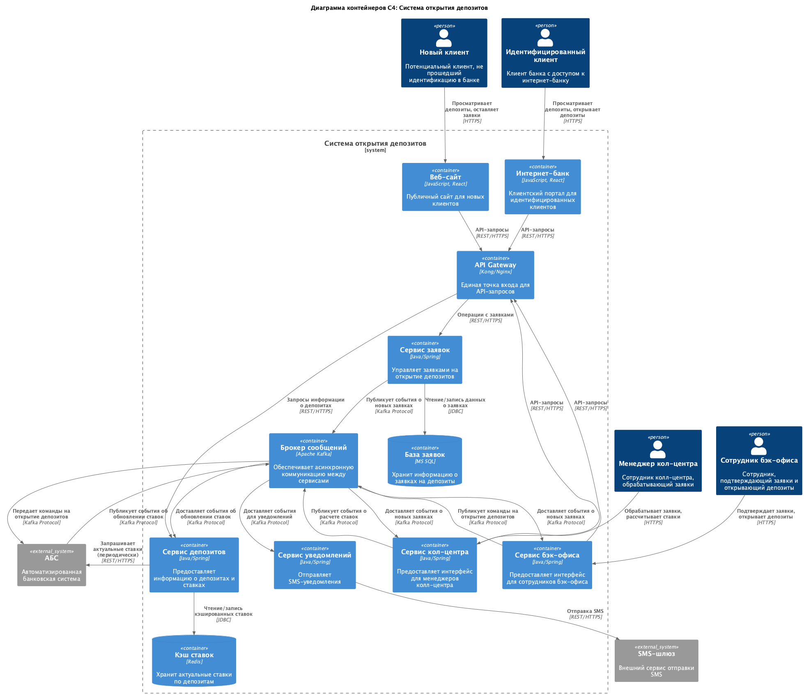

### **Название задачи:** Открытие депозитов

### **Автор:** Егор

### **Дата:** 12.09.2025

### **Функциональные требования**

| **№** | **Действующие лица или системы**                                            | **Use Case**                            | **Описание**                                                                                                                  |
| :---: | :-------------------------------------------------------------------------- | :-------------------------------------- | :---------------------------------------------------------------------------------------------------------------------------- |
| UC-1  | Новый клиент, Сайт, Сервис депозитов                                        | Просмотр списка депозитов               | Клиент заходит на сайт и видит список доступных депозитов с актуальными ставками.                                             |
| UC-2  | Новый клиент, Сайт, Сервис заявок                                           | Подача заявки на депозит                | Клиент оставляет свои ФИО и номер телефона для подачи заявки. Данные сохраняются, и менеджер кол-центра получает уведомление. |
| UC-3  | Менеджер кол-центра, Сервис кол-центра, Сервис депозитов                    | Обзвон клиента и расчет ставки          | Менеджер видит заявку, звонит клиенту и использует систему для расчета персонализированной ставки на основе правил из АБС.    |
| UC-4  | Идентифицированный клиент, Интернет-банк, Сервис депозитов                  | Просмотр персонализированных депозитов  | Клиент входит в интернет-банк и видит список депозитов с общими и персональными ставками.                                     |
| UC-5  | Идентифицированный клиент, Интернет-банк, Сервис заявок, Сервис уведомлений | Онлайн-открытие депозита                | Клиент выбирает депозит, указывает сумму и счет, подтверждает операцию SMS-кодом. Создается заявка на открытие.               |
| UC-6  | Сотрудник бэк-офиса, Сервис бэк-офиса, АБС                                  | Подтверждение и открытие депозита в АБС | Сотрудник проверяет одобренную заявку и подтверждает открытие депозита в АБС через асинхронный интерфейс.                     |
| UC-7  | Сотрудник кредитования, АБС                                                 | Обновление ставок по депозитам          | Сотрудник загружает ежедневный XLS-файл с актуальными ставками через веб-интерфейс АБС.                                       |
| UC-8  | Сервис уведомлений, АБС, SMS-шлюз                                           | Отправка уведомлений клиенту            | Система автоматически отправляет SMS клиенту при подтверждении ставки менеджером и после успешного открытия депозита.         |

### **Нефункциональные требования**

| **№** | **Требование**                                                                                       |
| :---: | :--------------------------------------------------------------------------------------------------- |
| NFR-1 | Общая доступность системы интернет-банка и связанных сервисов должна составлять 99.9% (24/7).        |
| NFR-2 | Время отклика на UI-операции не должно превышать 50 мс.                                              |
| NFR-3 | Все трафик (клиент-сервер и между сервисами) должен быть защищен с помощью TLS.                      |
| NFR-4 | Архитектура должна поддерживать горизонтальное масштабирование сервисов интернет-банка (Kubernetes). |
| NFR-5 | Прямые запросы к АБС запрещены. Взаимодействие только через асинхронный буфер (очередь сообщений).   |
| NFR-6 | Интерфейсы должны строго соответствовать системе дизайна и брендбуку банка.                          |
| NFR-7 | При выборе технологий предпочтение отдается уже используемым в банке (MS SQL, Oracle).               |
| NFR-8 | Нежелательны доработки ядра АБС. Функционал SMS реализуется отдельным сервисом.                      |

### **Решение**

Логика принятия решений:

- Асинхронная коммуникация через Kafka: Выбрана для соблюдения NFR-5 (изоляция АБС от нагрузки) и обеспечения надежности (NFR-1) и масштабируемости (NFR-4).
- Кэширование ставок в Сервисе депозитов: Решает проблему медленной загрузки справочных данных (NFR-2) и снижает нагрузку на АБС.
- Отдельный Сервис уведомлений: Позволяет выполнить NFR-8 (без доработок ядра АБС).
- Использование API Gateway: Централизует управление трафиком, безопасность (NFR-3) и упрощает роутинг для микросервисов.
- Выбор технологий: Основные сервисы можно реализовать на Java/Kotlin или .NET Core (соответствие NFR-7, экспертиза в банке). БД для сервисов — MS SQL. Kafka выбрана как стандарт для асинхронной коммуникации в экосистеме микросервисов.

### **Альтернативы**

Интеграция с АБС напрямую через его API вместо kafka – грубо нарушает NFR-5 и создает риски для стабильности и производительности АБС.
